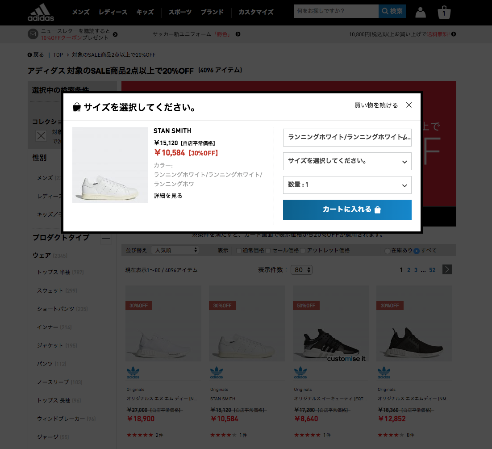
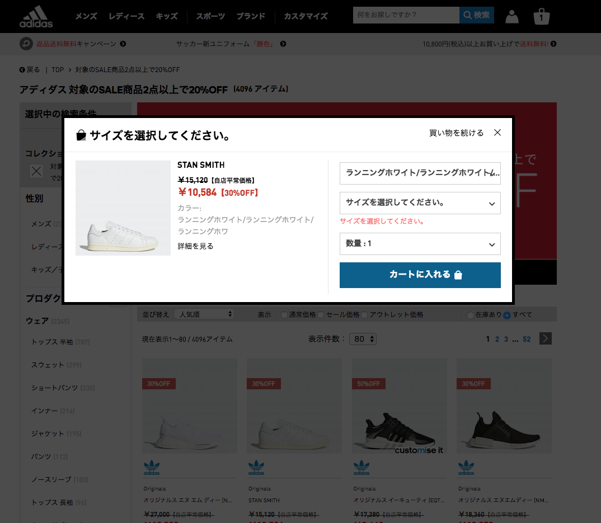
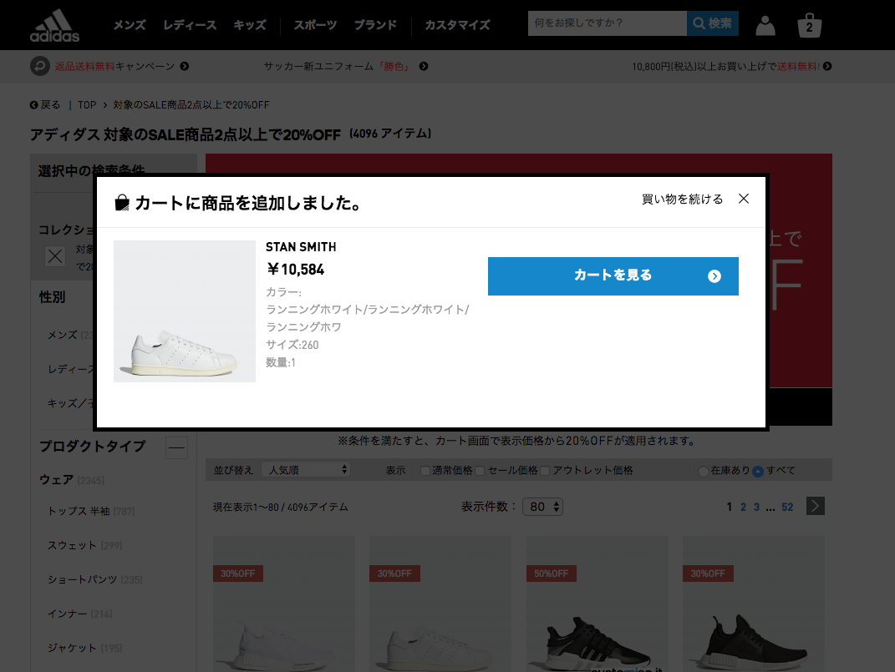
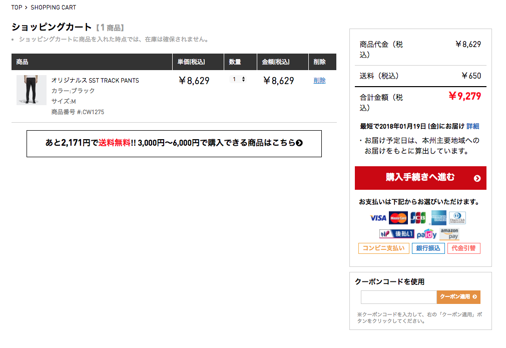
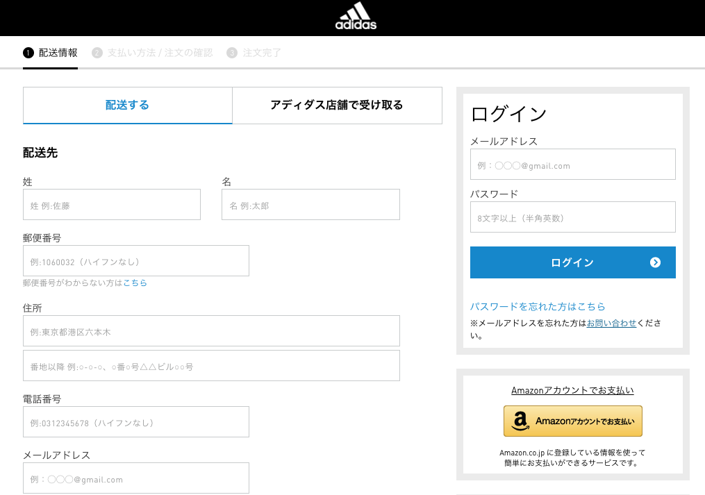
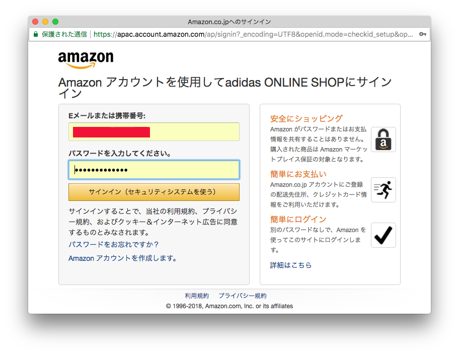
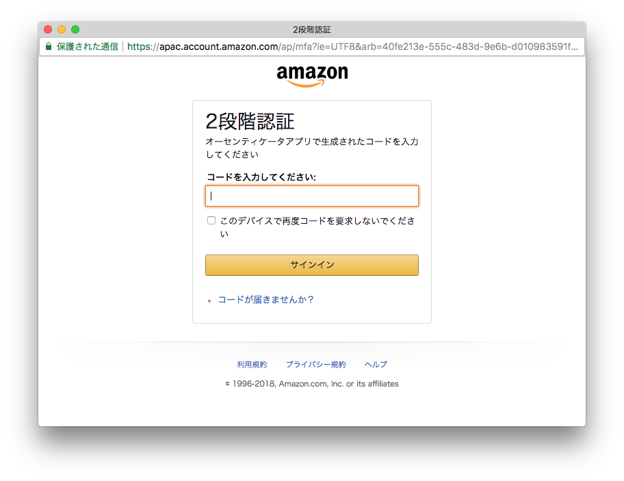
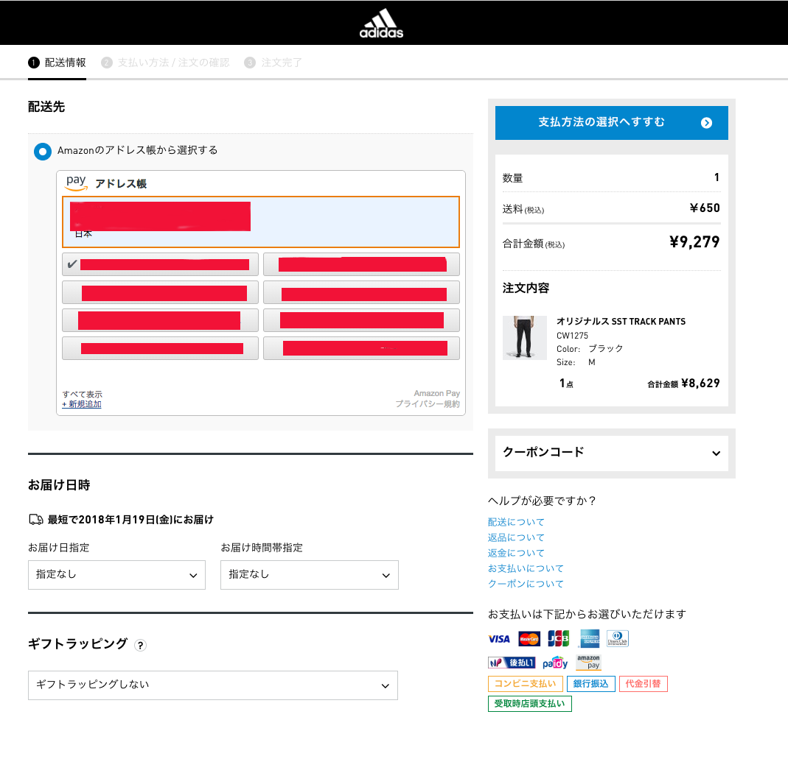
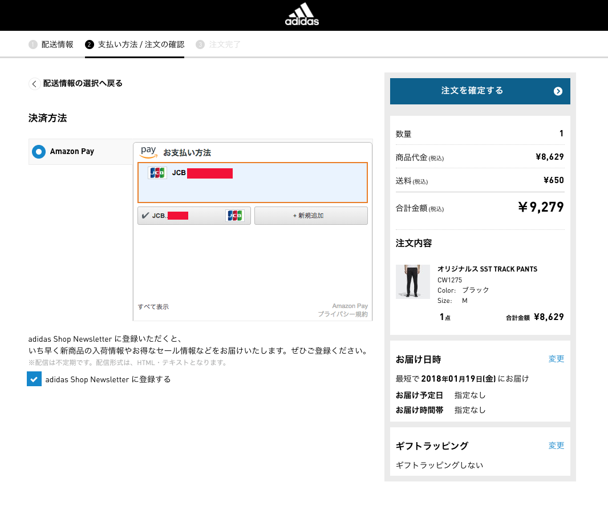

## 0. 購入

エラーチェック:

完了:

## 1.カート

- https://shop.adidas.jp/pc/secure/cart/recalc.cgi

## 2. アカウント/支払い選択

カートで `購入手続き` をクリック

- https://shop.adidas.jp/pc/secure/cart/step02l.cgi

## 3. ログイン

支払いで、 `Amazonアカウントで支払い` をクリック

2ファクター設定済みアカウント

## 4.お届け

AuthRes URL(GET+QUERYでいいのか？):

~~~
https://shop.adidas.jp/pc/secure/cart/step02.cgi?
coupon_code=&
cart_view_date=20180122&
access_key_hash=04a****......&
juchKess=8&
juchHflg=2&
amazon_payment_flag=1&
shopId=&
shop_stock=&
access_token=Atza%x**********......*&
token_type=bearer&
expires_in=3600&
scope=profile%20postal_code%20payments%3Awidget%20payments%3Ashipping_address

~~~

## 5.カード

- https://shop.adidas.jp/pc/secure/cart/step03.cgi

