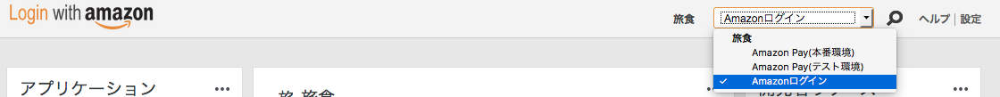
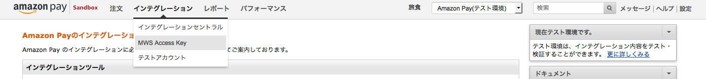

インテグレーション

## 1. [概要](https://pay.amazon.com/jp/developer/documentation/lpwa/201909330)

### 1.1. [イントロダクション](https://pay.amazon.com/jp/developer/documentation/lpwa/201985870)

### 1.2. [トランザクション](https://pay.amazon.com/jp/developer/documentation/lpwa/201957890)

## 2. インテグレーション

### 2.1 [STEP1 登録](https://pay.amazon.com/jp/developer/documentation/lpwa/201951060)

アカウント作成:

- 販売事業者はAmazon Pay専用のセラーセントラルのアカウントを作成する必要があります
- 通常のAmazon マーケットプレースの `seller central` とは **違います**
- **販売業者様申し込み**  https://pay.amazon.com/jp/signup から登録すること
- 販売事業者ID（セラーID）

Amazonログインの紐付け:

- セラーセントラルログイン > `Amazonログイン`(`Login With Amazon`) > アプリケーション登録

SANDBOXアカウント

- Amazon Pay SANDBOXのテストアカウントをセット

TLS/SSL認証:

- サーバは信頼される有効なTLS/SSL証明書を取得している必要があります
- localhost環境で動作させる場合は、TLS/SSL証明書は必要ありません

認証情報(セラーセントラルのAmazon Pay設定ページ（インテグレーション→MWS Aceess Key）:

- 出品者ID (Seller ID)
- Amazon Marketplace Web Service (MWS)アカウント情報のアクセスキーIDとシークレットアクセスキー
- Amazonログインアカウント情報のクライアントID

### 2.2 [STEP2 SDK設定](amazonpay.sdk.md)

### 2.3 [STEP3 ボタンウィジェットの追加](amazonpay.widgets.md)

### 2.4 [STEP4 アドレス帳/支払い方法](https://pay.amazon.com/jp/developer/documentation/lpwa/201952070)

### 2.5 [STEP5 注文詳細](https://pay.amazon.com/jp/developer/documentation/lpwa/201952090)

### 2.6 [STEP6 オーソリ](https://pay.amazon.com/jp/developer/documentation/lpwa/201952140)

- [オーソリ失敗](https://pay.amazon.com/jp/developer/documentation/lpwa/201953810)

### 2.7 [STEP7 売上請求(キャプチャー)](https://pay.amazon.com/jp/developer/documentation/lpwa/201953080)

### 2.8 [STEP8 売上完了](https://pay.amazon.com/jp/developer/documentation/lpwa/201953100)

### 2.9 [STEP9 返金](https://pay.amazon.com/jp/developer/documentation/lpwa/201953120)

### 2.10 オプション

- [ログイン時での注文情報へのアクセス](https://pay.amazon.com/jp/developer/documentation/lpwa/201953150)
- [リダイレクト認証を有効にする ](https://pay.amazon.com/jp/developer/documentation/lpwa/201953170)
- [プロファイル情報の取得](https://pay.amazon.com/jp/developer/documentation/lpwa/201953190)
- [アドレス帳とお支払い方法参照ウィジェットの表示
](https://pay.amazon.com/jp/developer/documentation/lpwa/201953590)
- [アドレス帳ウィジェット無しのインテグレーション ](https://pay.amazon.com/jp/developer/documentation/lpwa/201953690)
- [トランザクションフローの管理 ](https://pay.amazon.com/jp/developer/documentation/lpwa/201953710)
- [お支払い方法ウィジェットの再レンダリング ](https://pay.amazon.com/jp/developer/documentation/lpwa/201953730)
- [売上請求（Capture）とオーソリ（Authorize）での即時請求 ](https://pay.amazon.com/jp/developer/documentation/lpwa/201953750)(即時請求はやらずに、出荷時にキャプチャーする)
- [ゲスト購入](https://pay.amazon.com/jp/developer/documentation/lpwa/201953770)
- [オーソリ30日後の売上請求](https://pay.amazon.com/jp/developer/documentation/lpwa/201953790)(30日すぎると自動完了されるので、その前にキャプチャーを忘れないこと)
- [決済とトランザクションレポート](https://pay.amazon.com/jp/developer/documentation/lpwa/202000470)

## 3. 追加トランザクション

- [複雑な支払](https://pay.amazon.com/jp/developer/documentation/lpwa/201953820)
- [注文完了後の支払変更](https://pay.amazon.com/jp/developer/documentation/lpwa/201953830)

## 4. SANDBOX環境でのインテグレーションテスト

### 4.1 [SANDBOX環境でのインテグレーションテスト](https://pay.amazon.com/jp/developer/documentation/lpwa/201956350)
### 4.2 [Amazon Pay SANDBOXのテストアカウント設定](https://pay.amazon.com/jp/developer/documentation/lpwa/201956330)

- セラーセントラル
- マーケットプレイススイッチャー

### 4.3 [サンプルの住所と支払方法](https://pay.amazon.com/jp/developer/documentation/lpwa/201956410)

### 4.4 [SANDBOXと本番環境の相違点](https://pay.amazon.com/jp/developer/documentation/lpwa/201956460)

### 4.5 [SANDBOXシミュレーション](https://pay.amazon.com/jp/developer/documentation/lpwa/201956480)

### 4.6 [本番環境へインテグレーション切り替え](https://pay.amazon.com/jp/developer/documentation/lpwa/201956510)

## 5. リファレンス

### 5.1. エラーハンドリング

#### 5.1.1  [概要](https://pay.amazon.com/jp/developer/documentation/lpwa/201985680)

#### 5.1.2 [Amazon Pay API呼び出しからのエラーハンドリング](https://pay.amazon.com/jp/developer/documentation/lpwa/201954950)

#### 5.1.3 [Amazon Payウィジェットのエラーハンドリング](https://pay.amazon.com/jp/developer/documentation/lpwa/201954960)

### 5.2 [JavaScript](https://pay.amazon.com/jp/developer/documentation/lpwa/201909430)

### 5.3 エンコーディング

#### 5.3.1 [IPN: インスタント支払通知メッセージのハンドリング ](https://pay.amazon.com/jp/developer/documentation/lpwa/201985720)

#### 5.3.2 [カスタムデータフィールド](https://pay.amazon.com/jp/developer/documentation/lpwa/201955310)

#### 5.3.3 [サンプル通知](https://pay.amazon.com/jp/developer/documentation/lpwa/201955320)

#### 5.3.4 [IPNメッセージの応答](https://pay.amazon.com/jp/developer/documentation/lpwa/201955330)

#### 5.3.5 [IPNハンドリングのベストプラクティス](https://pay.amazon.com/jp/developer/documentation/lpwa/201955340)

### 5.4 API

#### 5.4.1 [APIの概要](https://pay.amazon.com/jp/developer/documentation/lpwa/201985740)

#### 5.4.2 [アクセストークン](https://pay.amazon.com/jp/developer/documentation/lpwa/201909520)

#### 5.4.3 [提供可能な購入者メールコンテンツ](https://pay.amazon.com/jp/developer/documentation/lpwa/201909530)

### 5.5 ウィジェット

#### 5.5.1 [ボタンウィジェット](https://pay.amazon.com/jp/developer/documentation/lpwa/201953980)

#### 5.5.2 [Amazon Payウィジェット](https://pay.amazon.com/jp/developer/documentation/lpwa/201954000)

### 5.6 TLS/SSL

#### 5.6.1 [TLS/SSLイントロダクション](https://pay.amazon.com/jp/developer/documentation/lpwa/201985770)

#### 5.6.2 [Amazonが要求するTLS/SSL証明書](https://pay.amazon.com/jp/developer/documentation/lpwa/201953960)

## 6.  付録

### 6.1 [インテグレーション概要](https://pay.amazon.com/jp/developer/documentation/lpwa/201955860)

### 6.2 [スタイルガイド](https://pay.amazon.com/jp/developer/documentation/lpwa/201909490)

### 6.3 [対象ブラウザ](https://pay.amazon.com/jp/developer/documentation/lpwa/202030000)

### 6.4. [用語](https://pay.amazon.com/jp/developer/documentation/lpwa/201909500)
