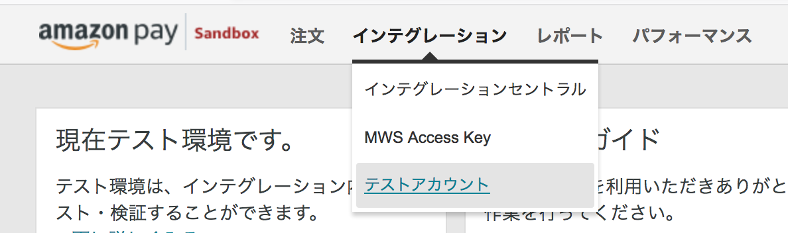

## [Amazon Pay SANDBOXのテストアカウント設定](https://pay.amazon.com/jp/developer/documentation/lpwa/201956330)

- セラーセントラル: https://sellercentral.amazon.co.jp

メールアドレス:

- 本番環境で利用しているアカウントのメールアドレスを利用したい場合は、＠マークの前に”+sandbox”を追加して利用することができます。
- 例えば、`taro@example.com` の場合では、`taro+sandbox@examlple.com` などです。
