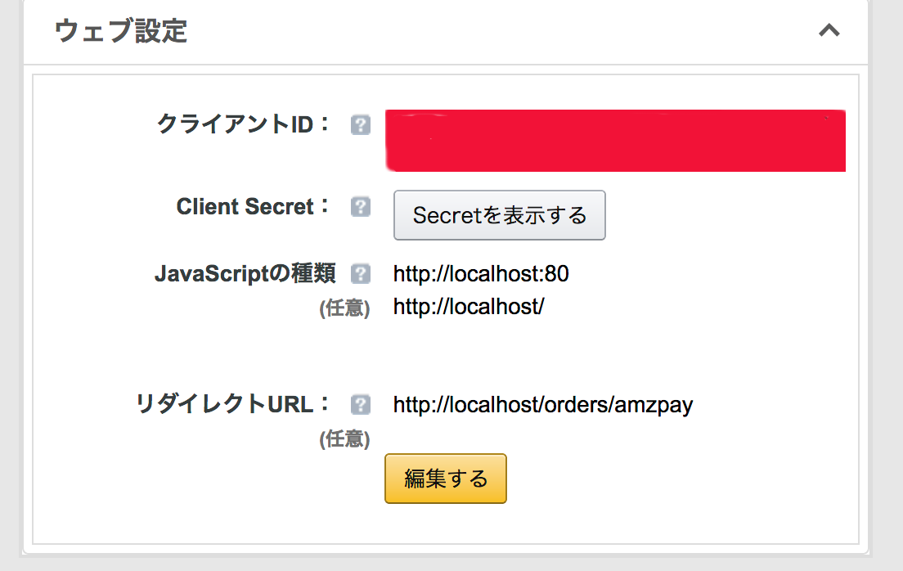

## [SDK設定](https://pay.amazon.com/jp/developer/documentation/lpwa/201951870)

### Login with Amazon 設定

- セラーセントラルのAmazonログインより、JavaScriptの種類とリダイレクトURLを設定します。
- localhost:80 の場合、 Javascript のオリジンに対して http://localhost/ も設定すること。

  

### サイト側の設定

- SANDBOX MWS エンドポイントとその他のURLをセットします。

  - Amazon MWS エンドポイント
  - Widgets.js URL
  - Profile API エンドポイント

## python

- https://github.com/amzn/amazon-pay-sdk-python
