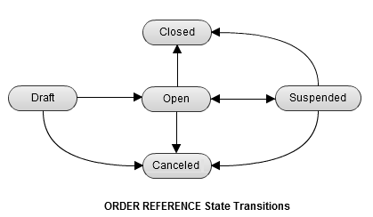

## Order Reference Status

- [Order Reference状態と理由コード](https://pay.amazon.com/jp/developer/documentation/apireference/201752920)

ステータス    |内容                         |可能なアクション
------------|-----------------------------|------------------------------
Draft       |確認前の初期状態                |設定、確認
Open        |オーソリリクエストが可能         |オーソリ、終了、キャンセル
Suspended   |この注文のオーソリは以後できない  |終了、キャンセル
Canceled    |キャンセルされた               |何もできない
Closed      |終了                         |オーソリの操作は可能

- `確認` すると `Open` になります
- `オーソリ`に問題があると `Suspended` になります
- `参照` は常に可能
- `売上請求`されているとキャンセルできない
