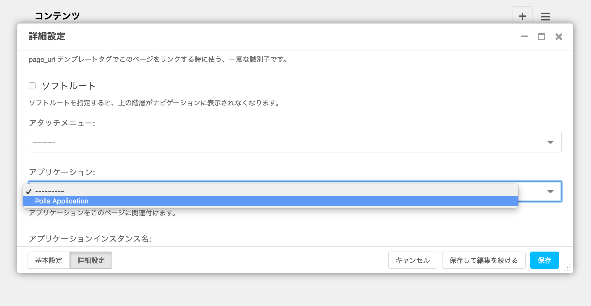

[Apphooks](http://docs.django-cms.org/en/release-3.4.x/introduction/apphooks.html)

- プラグインを作ったらアプリケーションフックを追加する

## フックの作成

~~~bash
$ vi polls_cms_integration/cms_apps.py
~~~

~~~py
# coding: utf-8
from cms.app_base import CMSApp
from cms.apphook_pool import apphook_pool
from django.utils.translation import ugettext_lazy as _

class PollsApphook(CMSApp):
    app_name = "polls"
    name = _("Polls Application")

    def get_urls(self, page=None, language=None, **kwargs):
        return ["polls.urls"]

apphook_pool.register(PollsApphook)  # register the application
~~~

- Djangoのリスタート

## フックでアプリをアタッチする

- /ja/polls/browser/ ページにアタッチ

- /ja/polls/browser/1/ アンカーが表示される
- クリックすると /ja/polls/browser/1/vote/ にPOSTされる
- その後、/ja/polls/browser/1/results/  にリダイレクトして結果が表示

polls.views.vote:

~~~py
def vote(request, poll_id):
    p = get_object_or_404(Poll, pk=poll_id)
    try:
        selected_choice = p.choice_set.get(pk=request.POST['choice'])
    except (KeyError, Choice.DoesNotExist):
        # Redisplay the poll voting form.
        return render(request, 'polls/detail.html', {
            'poll': p,
            'error_message': "You didn't select a choice.",
        })
    else:
        selected_choice.votes += 1
        selected_choice.save()
        # Always return an HttpResponseRedirect after successfully dealing
        # with POST data. This prevents data from being posted twice if a
        # user hits the Back button.
        return HttpResponseRedirect(reverse('polls:results', args=(p.id,)))
~~~
