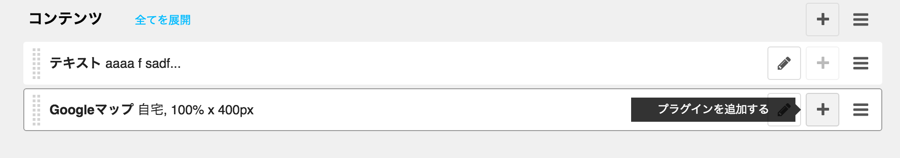
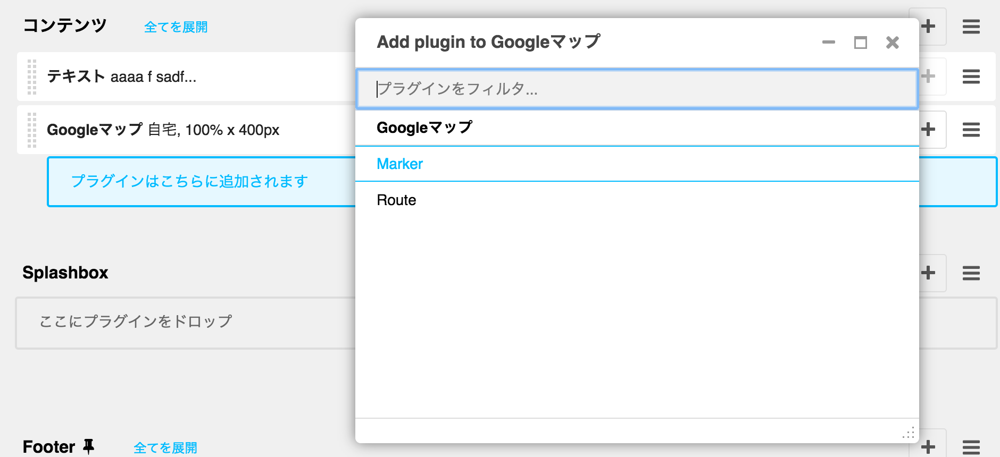

- [divio/djangocms-googlemap](https://github.com/divio/djangocms-googlemap)
- https://marketplace.django-cms.org/en/addons/browse/djangocms-googlemap/
- [Google Map スタイル](https://developers.google.com/maps/documentation/javascript/styling)

## マーカー

 Google Map プラグインを追加したあとで、

そのブロックに Google Map Maker プラグインを追加する

