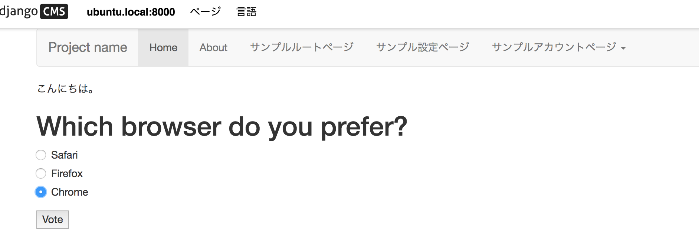

## pollsアプリの追加

django-cmsと依存関係の無い単純なDjangoアプリ

~~~bash
$ pip install -e git+https://github.com/divio/django-polls.git#egg=polls
Obtaining polls from git+https://github.com/divio/django-polls.git#egg=polls
  Cloning https://github.com/divio/django-polls.git to /home/vagrant/.anyenv/envs/pyenv/versions/3.6.2/envs/p3_6_2/src/polls
Installing collected packages: polls
  Running setup.py develop for polls
Successfully installed polls
~~~

settings.py:

~~~py
INSTALLED_APPS += [
    'polls',
]
~~~

### urls.py

デフォルト:

~~~py
urlpatterns += i18n_patterns(
    url(r'^admin/', include(admin.site.urls)),  # NOQA
    url(r'^', include('cms.urls')),
)
~~~

~~~py
urlpatterns += i18n_patterns(
    url(r'^admin/', include(admin.site.urls)),  # NOQA
    url(r'^polls/', include('polls.urls', namespace='polls')),
    url(r'^', include('cms.urls')),
)
~~~

### 動かす

migrate:

~~~bash
$ python manage.py migrate polls
Operations to perform:
  Apply all migrations: polls
Running migrations:
  Applying polls.0001_initial... OK
~~~

admin UI:

- /ja/admin/polls/poll/
- 新規作成する

登録:

- /ja/polls/ 一覧
- /ja/polls/1/ フォーム
- /ja/polls/1/results/ 完了と結果

## polls アプリのレイアウトを django-cmsサイトに合わせる

base.html:

~~~bash
$ mkdir mysite2/templates/polls
$ vi mysite2/templates/polls/base.html
~~~

~~~html
  {# django-cms サイトの base を拡張 #}

        {# django-cms content ブロックを修正 #}
     {# polls がレンダリングするブロック #}
    

~~~

## プラグインアダプタ `polls_cms_integration` の作成

~~~bash
$ python manage.py startapp polls_cms_integration
$ tree polls_cms_integration/

polls_cms_integration/
├── __init__.py
├── admin.py
├── apps.py
├── migrations
│   └── __init__.py
├── models.py
├── tests.py
└── views.py

1 directory, 7 files
~~~

settings.py:

~~~py
INSTALLED_APPS += [
    'polls',
    'polls_cms_integration',
]
~~~

## プラグインモデル

~~~bash
$ vi polls_cms_integration/models.py
~~~

~~~py
# coding: utf-8
from django.db import models
from cms.models import CMSPlugin
from polls.models import Poll

class PollPluginModel(CMSPlugin):
    '''投票プラグイン'''
    poll = models.ForeignKey(Poll)

    def __unicode__(self):
        return self.poll.question
~~~

## プラグインクラス

~~~bash
$ vi polls_cms_integration/cms_plugins.py
~~~

~~~py
# coding: utf-8
from cms.plugin_base import CMSPluginBase
from cms.plugin_pool import plugin_pool
from polls_cms_integration.models import PollPluginModel
from django.utils.translation import ugettext as _

class PollPluginPublisher(CMSPluginBase):
    model = PollPluginModel  # プラグインが保存されるモデル
    module = _("Polls")
    name = _("Poll Plugin")  # プラグイン名
    render_template = "polls_cms_integration/poll_plugin.html"  # レンダリングするテンプレート

    def render(self, context, instance, placeholder):
        context.update({'instance': instance})
        return context

plugin_pool.register_plugin(PollPluginPublisher)  # register the plugin
~~~

## プラグインレンダリングテンプレート

~~~bash
$ mkdir -p polls_cms_integration/templates/polls_cms_integration
$ vi  polls_cms_integration/templates/polls_cms_integration/poll_plugin.html
~~~

~~~html
<h1>{{ instance.poll.question }}</h1>           {# instance: プラグインモデル PollPluginModel #}

<form action="" method="post">
    
    

        
            

                <label>
                    <input type="radio" name="choice" value="{{ choice.id }}">
                    {{ choice.choice_text }}
                </label>
            

        
    

    <input type="submit" value="Vote" />
</form>
~~~

## 組み込み

~~~bash
$ python manage.py makemigrations polls_cms_integration
Migrations for 'polls_cms_integration':
  polls_cms_integration/migrations/0001_initial.py:
    - Create model PollPluginModel

$ python manage.py migrate polls_cms_integration
Operations to perform:
  Apply all migrations: polls_cms_integration
Running migrations:
  Applying polls_cms_integration.0001_initial... OK
~~~

