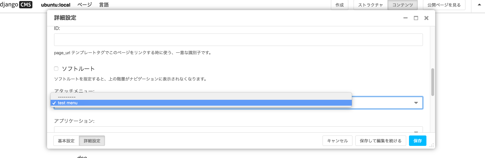
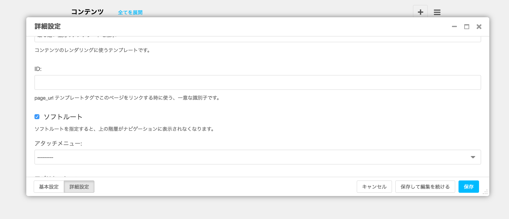

- [How to customise navigation menus](http://docs.django-cms.org/en/release-3.4.x/how_to/menus.html)

## デフォルト

レイアウトに [show_menu](cms.show_menu.md) させる

~~~html

...
 
...
~~~

メニューテンプレートが指定されない場合、`menus` アプリのテンプレートが使われます(templates/menu/menu.html):

~~~html



<li class="child selected ancestor sibling desc
endant">
    <a href="{{ child.attr.redirect_url|default:child.get_absolute_url }}">{{ child.get_menu_title }}</a>
    
    <ul>
        
    </ul>
    
</li>

~~~

## カスタマイズ

メニューテンプレートをレイアウトに明示的に指定します:

~~~html

...
 
...
~~~

アプリの templates/menu.html を作ります:

~~~html
{# 例: --bootstrap yes オプションで作成される menu.html #}



    <li class="ancestor
         active
         dropdown">
        
            <a class="dropdown-toggle" data-toggle="dropdown" href="#">
                {{ child.get_menu_title }} 
            </a>
            <ul class="dropdown-menu">
                
            </ul>
        
            <a href="{{ child.get_absolute_url }}">{{ child.get_menu_title }}</a>
        
    </li>
    

~~~

## メニュー : 固定で拡張する

- [Menus](http://docs.django-cms.org/en/release-3.4.x/how_to/menus.html#menus)
- [menus.base.NavigationNode](http://docs.django-cms.org/en/release-3.4.x/reference/navigation.html#menus.base.NavigationNode)

mysite/cms_menus.py:

~~~py
from menus.base import Menu, NavigationNode
from menus.menu_pool import menu_pool
from django.utils.translation import ugettext_lazy as _

class TestMenu(Menu):

    def get_nodes(self, request):
        nodes = []
        n = NavigationNode(_('sample root page'), "/", 1)
        n2 = NavigationNode(_('sample settings page'), "/bye/", 2)
        n3 = NavigationNode(_('sample account page'), "/hello/", 3)
        n4 = NavigationNode(_('sample my profile page'), "/hello/world/", 4, 3)
        nodes.append(n)
        nodes.append(n2)
        nodes.append(n3)
        nodes.append(n4)
        return nodes

menu_pool.register_menu(TestMenu)
~~~

## 追加メニュー

- [Attach Menus ](http://docs.django-cms.org/en/release-3.4.x/how_to/menus.html#integration-attach-menus)
- [CMSAttachMenu](http://docs.django-cms.org/en/release-3.4.x/reference/navigation.html#cms.menu_bases.CMSAttachMenu)

~~~py
from menus.base import NavigationNode
from menus.menu_pool import menu_pool
from django.utils.translation import ugettext_lazy as _
from cms.menu_bases import CMSAttachMenu

class TestMenu(CMSAttachMenu):

    name = _("test menu")

    def get_nodes(self, request):
        nodes = []
        n = NavigationNode(_('sample root page'), "/", 1)
        n2 = NavigationNode(_('sample settings page'), "/bye/", 2)
        n3 = NavigationNode(_('sample account page'), "/hello/", 3)
        n4 = NavigationNode(_('sample my profile page'), "/hello/world/", 4, 3)
        nodes.append(n)
        nodes.append(n2)
        nodes.append(n3)
        nodes.append(n4)
        return nodes

menu_pool.register_menu(TestMenu)
~~~

## ナビゲージョン修正

- [Navigation Modifiers](http://docs.django-cms.org/en/release-3.4.x/how_to/menus.html#navigation-modifiers)

## 管理者メニュー

- cms/toolbar/items/menu.html が管理者メニューテンプレートです

## メニューシステムの動作

- [How the menu system works](http://docs.django-cms.org/en/release-3.4.x/topics/menu_system.html)

### [ソフトルート](http://docs.django-cms.org/en/release-3.4.x/topics/menu_system.html#soft-root)

- メニューツリーのルートとして振る舞うノード
- メニューツリーが深くなりすぎると、全てのノードのルート(ハードルート?) から表示するとトピックに集中できないので、現在のトピックにふさわしいルートをソフトルートとして定義することでツリーを小さく見やすくさせる。

