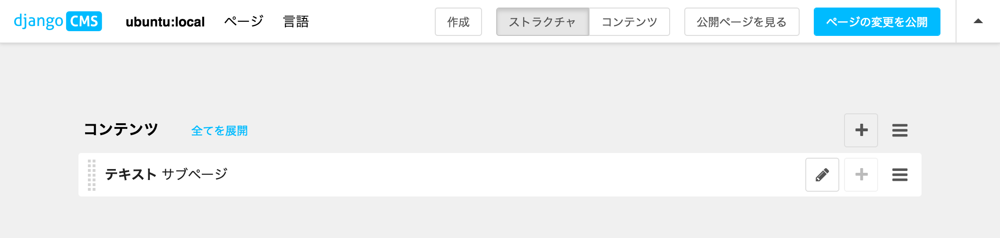
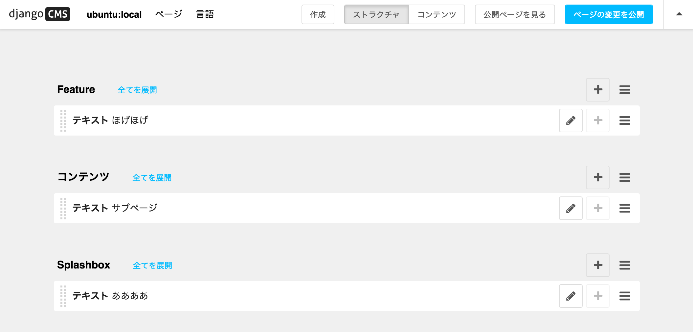
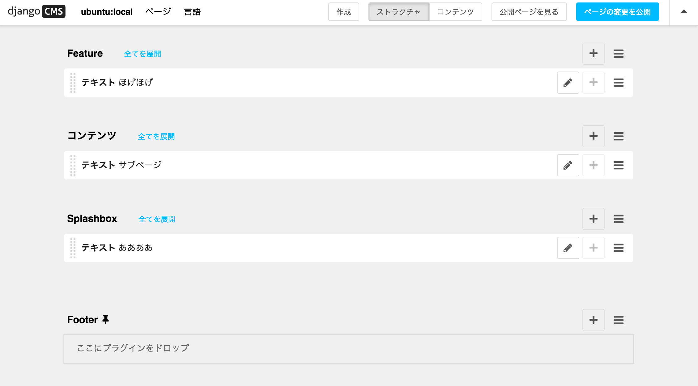

- [placeholders](http://docs.django-cms.org/en/release-3.4.x/introduction/templates_placeholders.html#placeholders)

## placeholder テンプレートタグ

~~~~html

	

~~~

~~~html

	 	{# HDKNR #}
	
		{# HDKNR #}

~~~

## static placeholder テンプレートタグ

- 一箇所変更すると全ページに反映される

base.html とかに置く:

~~~html
...
<body>
    

    

        <ul class="nav">
            
        </ul>
        
    

    <footer>
      
    </footer>

    
</body>
~~~

