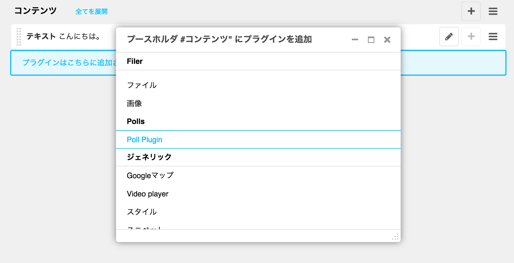
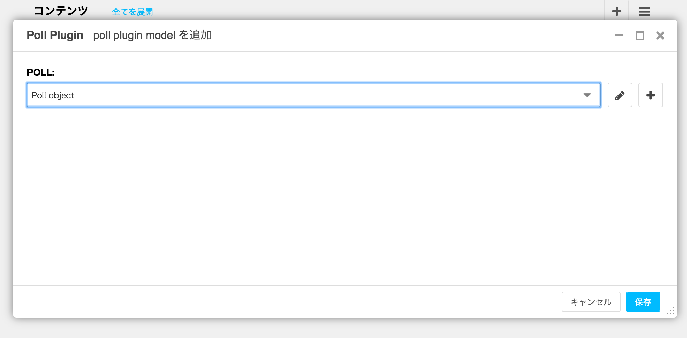
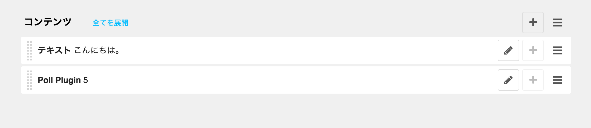
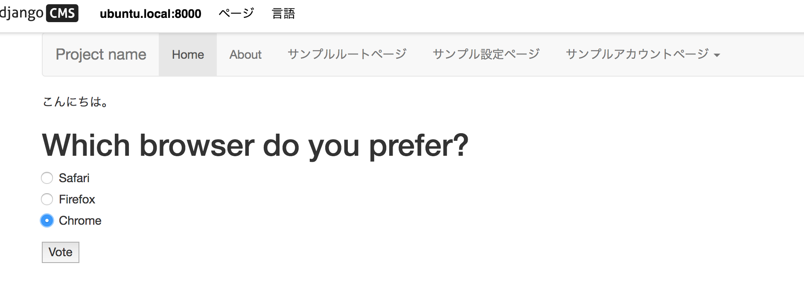
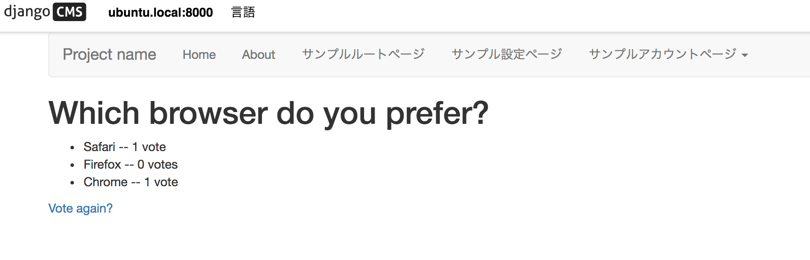

- [plugin](http://docs.django-cms.org/en/release-3.4.x/introduction/plugins.html)

## プラグインアダプタ `polls_cms_integration` の作成

~~~bash
$ python manage.py startapp polls_cms_integration
$ tree polls_cms_integration/

polls_cms_integration/
├── __init__.py
├── admin.py
├── apps.py
├── migrations
│   └── __init__.py
├── models.py
├── tests.py
└── views.py

1 directory, 7 files
~~~

settings.py:

~~~py
INSTALLED_APPS += [
    'polls',
    'polls_cms_integration',
]
~~~

## プラグインモデル

- [プラグインモデル](http://docs.django-cms.org/en/release-3.4.x/introduction/plugins.html#the-plugin-model)

~~~bash
$ vi polls_cms_integration/models.py
~~~

~~~py
# coding: utf-8
from django.db import models
from cms.models import CMSPlugin
from polls.models import Poll

class PollPluginModel(CMSPlugin):
    '''投票プラグイン'''
    poll = models.ForeignKey(Poll)

    def __unicode__(self):
        return self.poll.question
~~~

## プラグインクラス

- [プラグインクラス](http://docs.django-cms.org/en/release-3.4.x/introduction/plugins.html#the-plugin-class)

~~~bash
$ vi polls_cms_integration/cms_plugins.py
~~~

~~~py
# coding: utf-8
from cms.plugin_base import CMSPluginBase
from cms.plugin_pool import plugin_pool
from polls_cms_integration.models import PollPluginModel
from django.utils.translation import ugettext as _

class PollPluginPublisher(CMSPluginBase):
    model = PollPluginModel  # プラグインが保存されるモデル
    module = _("Polls")
    name = _("Poll Plugin")  # プラグイン名
    render_template = "polls_cms_integration/poll_plugin.html"  # レンダリングするテンプレート

    def render(self, context, instance, placeholder):
        context.update({'instance': instance})
        return context

plugin_pool.register_plugin(PollPluginPublisher)  # register the plugin
~~~

## プラグインレンダリングテンプレート

~~~bash
$ mkdir -p polls_cms_integration/templates/polls_cms_integration
$ vi  polls_cms_integration/templates/polls_cms_integration/poll_plugin.html
~~~

~~~html
<h1>{{ instance.poll.question }}</h1>           {# instance: プラグインモデル PollPluginModel #}

<form action="" method="post">
    
    

        
            

                <label>
                    <input type="radio" name="choice" value="{{ choice.id }}">
                    {{ choice.choice_text }}
                </label>
            

        
    

    <input type="submit" value="Vote" />
</form>
~~~

## 組み込み

~~~bash
$ python manage.py makemigrations polls_cms_integration
Migrations for 'polls_cms_integration':
  polls_cms_integration/migrations/0001_initial.py:
    - Create model PollPluginModel

$ python manage.py migrate polls_cms_integration
Operations to perform:
  Apply all migrations: polls_cms_integration
Running migrations:
  Applying polls_cms_integration.0001_initial... OK
~~~

## 基本プラグイン

- [Some commonly-used plugins](http://docs.django-cms.org/en/release-3.4.x/topics/commonly_used_plugins.html#commonly-used-plugins)

djangocms-installer でデフォルトで入ります:

- [django-filer](cms.filer.md)
- https://github.com/divio/djangocms-link
- https://github.com/divio/djangocms-file
- https://github.com/divio/djangocms-picture
- https://github.com/divio/djangocms-video
- [djangocms-googlemap](cms.googlemap.md)
- https://github.com/divio/djangocms-snippet
- https://github.com/divio/djangocms-style
- https://github.com/divio/djangocms-column

~~~py
INSTALLED_APPS = [
    ...
    'djangocms_link',
    'djangocms_file',
    'djangocms_picture',
    'djangocms_video',
    'djangocms_googlemap',
    'djangocms_snippet',
    'djangocms_style',
    'djangocms_column',
    ...
]
~~~
