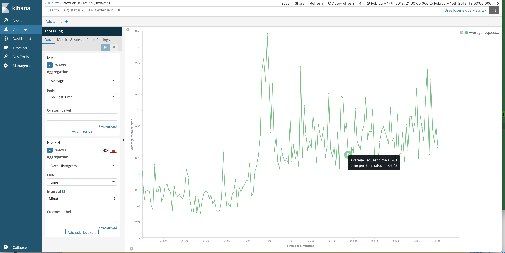

LTSV形式のnginxログをElastic/Kibanaでビジュアル化する

## nginx: log_format.conf

~~~
log_format ltsv 'time:$time_iso8601\t'
                'remote_addr:$remote_addr\t'
                'request_method:$request_method\t'
                'request_length:$request_length\t'
                'request_uri:$request_uri\t'
                'https:$https\t'
                'uri:$uri\t'
                'query_string:$query_string\t'
                'status:$status\t'
                'bytes_sent:$bytes_sent\t'
                'body_bytes_sent:$body_bytes_sent\t'
                'referer:$http_referer\t'
                'useragent:$http_user_agent\t'
                'forwardedfor:$http_x_forwarded_for\t'
                'request_time:$request_time\t'
                'upstream_response_time:$upstream_response_time';
~~~

nginx.conf:

~~~
...
access_log  /var/log/nginx/access.ltsv.log  ltsv;
...
~~~

## PYPI

pypi.txt:

~~~
# elasticsearch
elasticsearch
elasticsearch-dsl

# text
ltsv

# date
python-dateutil
~~~

~~~bash
$ pip install -r pypi.txt
~~~

## Nginx DocType

- [fields.py](https://github.com/elastic/elasticsearch-dsl-py/blob/master/elasticsearch_dsl/field.py)

nginx.py:

~~~py
from elasticsearch_dsl import DocType, Text, Boolean, Date, Double, Integer                                                             
from elasticsearch_dsl.connections import connections               
connections.create_connection(hosts=['localhost'])                  

class Nginx(DocType):             
    time = Date()                 
    remote_addr = Text()          
    request_method = Text()       
    request_length = Integer()    
    request_uri = Text()          
    https = Text()                
    uri = Text()                  
    query_string = Text()         
    status = Text()               
    bytes_sent = Integer()        
    referer = Text()              
    useragent = Text()            
    forwardedfor = Text()         
    request_time = Double()       
    upstream_response_time = Double()                               

    class Meta:                   
        index = 'access_log'      
        doc_type = "nginx"        

    def save(self, *args, **kwargs):
        return super(Nginx, self).save(*args, **kwargs)

Nginx.init()
~~~

## アクセスログローダー

access_log.py :

~~~py
from nginx import Nginx
import ltsv
from dateutil import parser

for i in ltsv.reader(open('access.ltsv.log')):
    data = dict([v for v in i if v[1] != '-'])
    data['time'] = parser.parse(data['time'])
    Nginx(**data).save()
~~~

## スキーマ確認

~~~bash
$ curl -XGET localhost:9200/access_log/_mapping?pretty
~~~

[結果](mapping.nginx.json)

## Visualization

インデックス:

- access_log

Metrix > Y-Axis:

- Aggregation: Average
- Field: request_time

Buckets > X-Axis:

- Aggregation: Date Histgram
- Field: time
- Interval: Minute

## TODO:

- AWS Elasticsearch + Kibana を構成する
- ログを AWS S3 にシッピング
- Amazon Lamda でログローダを実装
- バケット追加のイベントでLamdaのローダーをキック
