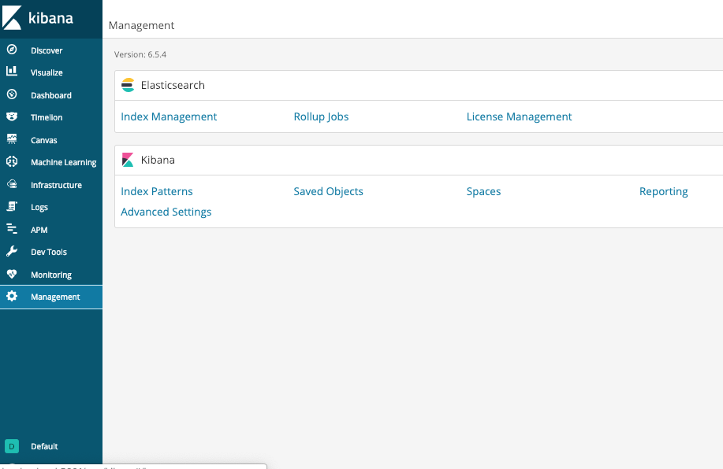
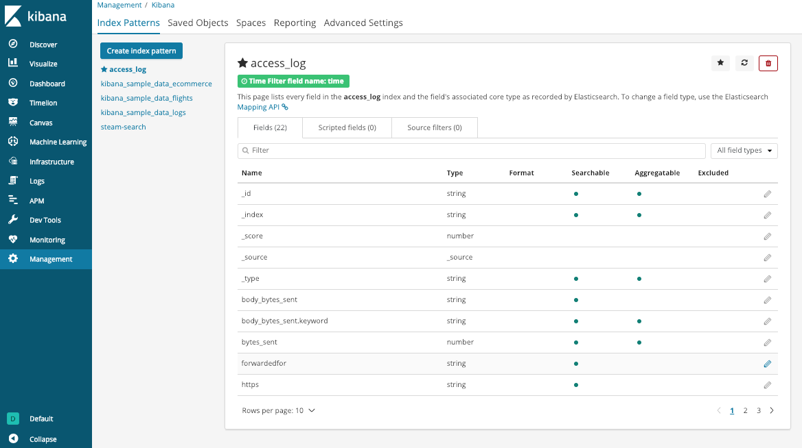
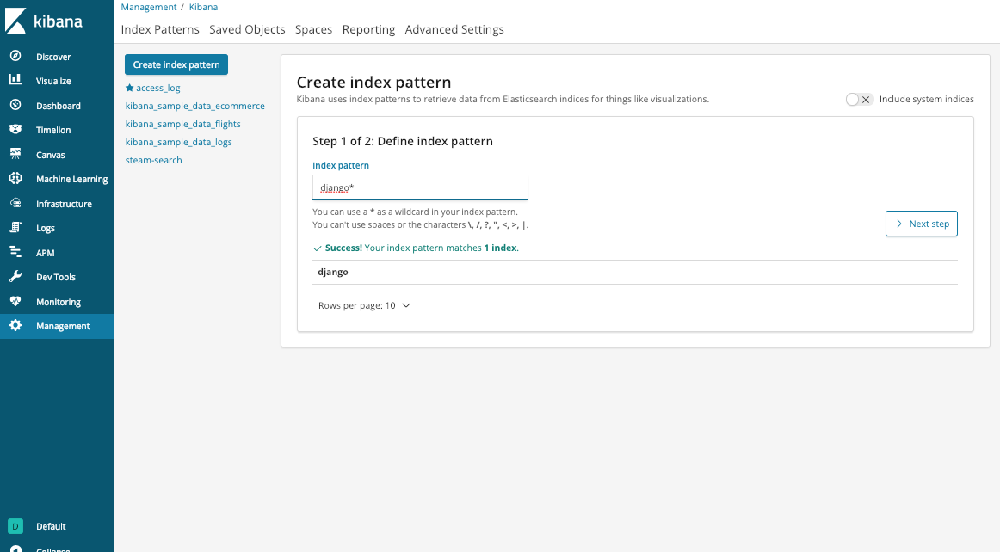
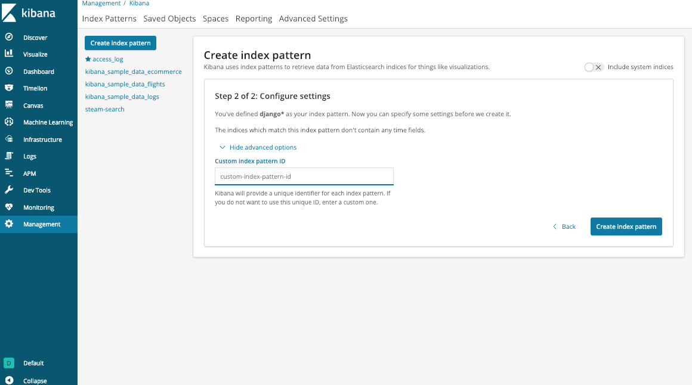
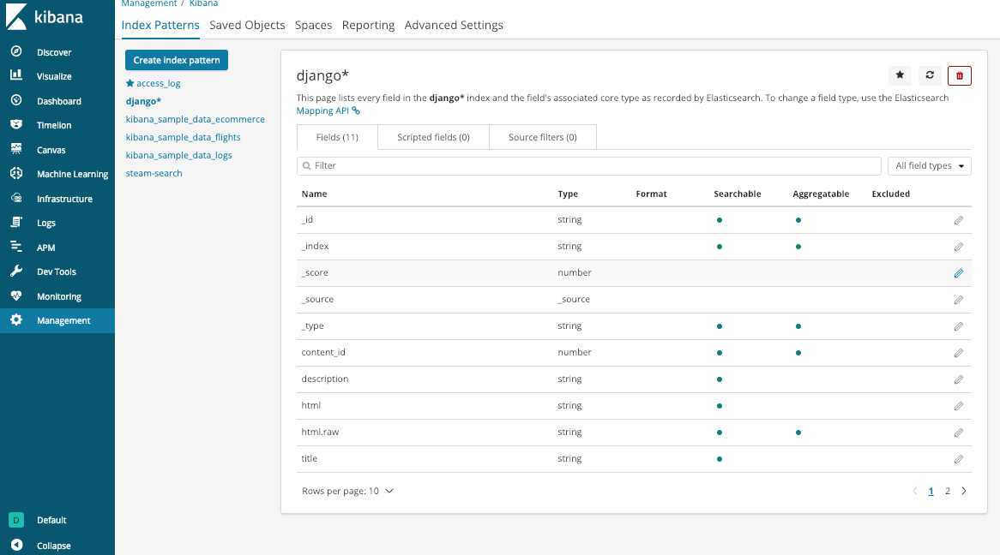

# Index Pattern

- [Index Patterns | Kibana User Guide [6.5] | Elastic](https://www.elastic.co/guide/en/kibana/current/index-patterns.html)

## Kibana > Management > Index Pattern

## API

- [Saved Objects API | Kibana User Guide [master] | Elastic](https://www.elastic.co/guide/en/kibana/master/saved-objects-api.html)
